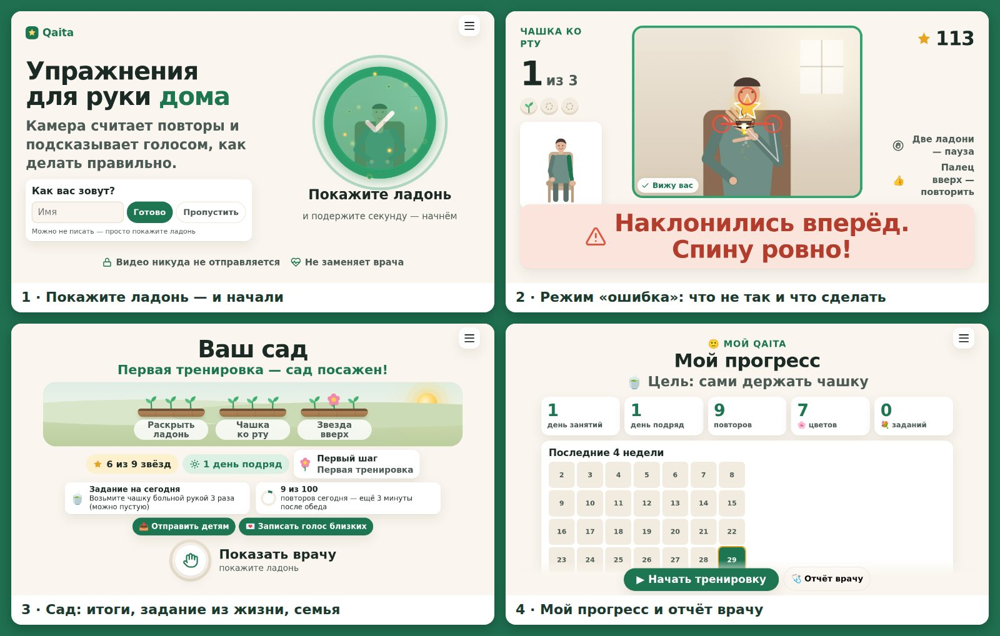
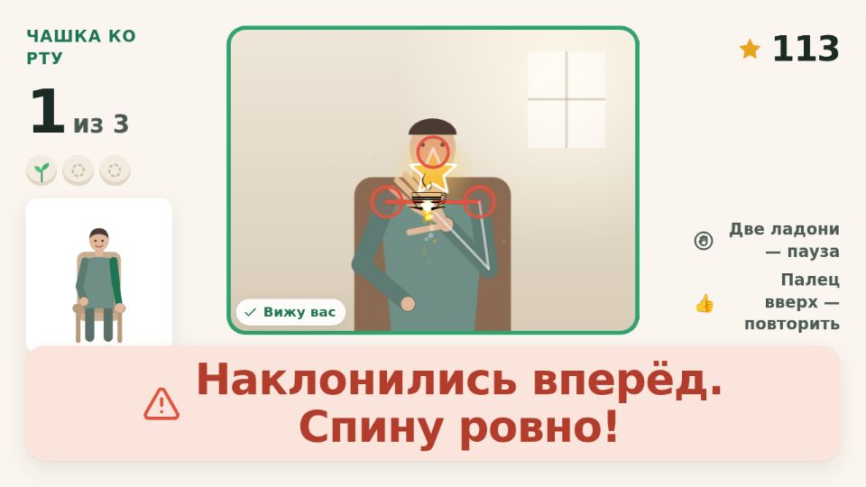
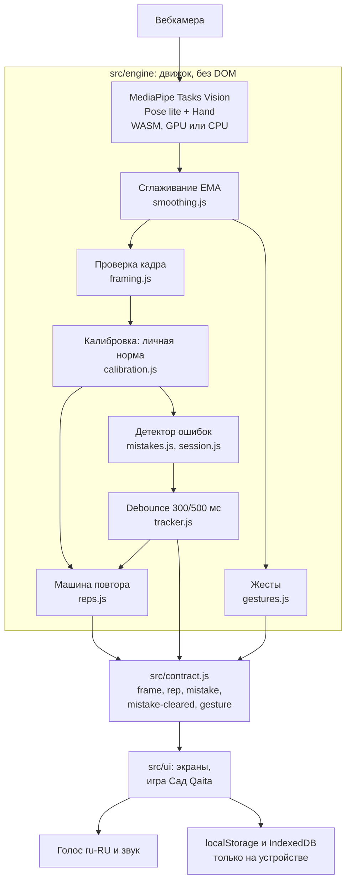

<p align="center">
  
</p>

<h1 align="center">Qaita — реабилитолог в каждой вебкамере</h1>

<p align="center">
  <b>Qaita возвращает руку в жизнь — тренажёр руки после инсульта через обычную вебкамеру.</b><br>
  Ссылка в браузере, без установки и без мыши: камера считает повторы, ловит компенсации и голосом подсказывает, как исправить.
</p>

<p align="center">
  <a href="https://marvindpp.github.io/qaita/"></a>
  &nbsp;
  <a href="https://marvindpp.github.io/qaita/?mock=1"></a>
</p>

<p align="center">
  <a href="https://github.com/marvindpp/qaita/actions/workflows/deploy.yml"></a>
  <a href="#тесты"></a>
  
  <a href="#приватность-и-безопасность"></a>
  
</p>

<p align="center">
  🔗 <b>https://marvindpp.github.io/qaita/</b> — нужен только браузер и вебкамера. Единственный клик — <b>разрешить камеру</b>, дальше всё жестами.
</p>

<p align="center">
  
  <br><sub>Скриншоты сняты на <code>?mock=1</code> (виртуальный пациент вместо камеры), текущий <code>main</code>.</sub>
</p>

**Qaita** (каз. «қайта» — «снова») — домашний тренажёр для упражнений на руку после инсульта. Человек 50–75 лет открывает ссылку и садится на стул перед ноутбуком. Упражнения поданы как игра «Сад Qaita», прогресс собирается в отчёт «Показать врачу». Команда «Хастлеры», ADMIT Hackathon «Motion» 2026.

## Для жюри: критерий → раздел

| Критерий | Баллы | Где смотреть |
|---|---|---|
| Работоспособность | 30 | [Как проверить за 2 минуты](#как-проверить-за-2-минуты) · [Запуск локально](#запуск-локально) · [Если не грузится](#если-не-грузится) |
| Режим «ошибка» | 20 | [Режим «ошибка»: 8 компенсаций](#режим-ошибка-8-компенсаций) · [Надёжность](#надёжность-от-сырого-кадра-к-одной-подсказке) |
| Техническая реализация | 20 | [Как устроено](#как-устроено) · [Тесты](#тесты) · [Жесты и упражнения](#жесты-и-упражнения) |
| UX и дизайн | 15 | [Решение за 30 секунд](#решение-за-30-секунд) · [Сценарий](#сценарий) · [Как сесть](#как-сесть) |
| Оригинальность | 10 | [Проблема в цифрах](#проблема-в-цифрах) · [Из тренажёра — в жизнь](#из-тренажёра--в-жизнь) |
| Бонусы | 5 | [Бонусы кейса](#бонусы-кейса) |

Ещё: [Масштабирование и бизнес (план)](#масштабирование-и-бизнес-план) · [Приватность](#приватность-и-безопасность) · [Команда и происхождение кода](#команда-и-происхождение-кода)

---

## Проблема в цифрах

| Факт | Источник |
|---|---|
| **~12 млн** новых инсультов в год, у **~80%** выживших остаются нарушения функций | [WSO Global Stroke Fact Sheet 2025](https://journals.sagepub.com/doi/10.1177/17474930241308142) |
| Нарушения функции руки — **больше чем у половины** выживших после инсульта | [Frontiers in Medicine 2025](https://pmc.ncbi.nlm.nih.gov/articles/PMC12660197/) |
| **Казахстан:** ~40–49 тыс. инсультов в год, постинсультную реабилитацию в 2024 году получили **8 762** человека (примерно каждый пятый) | [CAJMHE 2018–2024](https://cajmhe.com/index.php/journal/article/view/498), [Kazpravda](https://kazpravda.kz/n/ezhegodno-v-kazahstane-registriruetsya-okolo-40-tysyach-sluchaev-insulta/) |
| На занятии пациент делает в среднем **32 повтора** для руки, а для восстановления нужны сотни | [Lang et al., Arch PM&R](https://www.archives-pmr.org/article/S0003-9993(09)00353-0/abstract) |
| **До 70%** пациентов не выполняют домашние упражнения: забывают и скучно | [Physiopedia](https://www.physio-pedia.com/Adherence_to_Home_Exercise_Programs), [JMIR 2018](https://mhealth.jmir.org/2018/3/e47/) |
| Дома пациенты **компенсируют** корпусом и плечом — закрепляется неправильный паттерн; обычная вебкамера с MediaPipe умеет это ловить | [Frontiers in Medicine 2025](https://pmc.ncbi.nlm.nih.gov/articles/PMC12660197/), [J NeuroEng Rehab 2025](https://link.springer.com/article/10.1186/s12984-025-01808-4) |
| Усталость после инсульта — у **42–53%** | [Eur Stroke J](https://doi.org/10.1177/23969873211047681) |
| Депрессия у ухаживающих родственников — **20–50%** | [PMC10830437](https://pmc.ncbi.nlm.nih.gov/articles/PMC10830437/), [PMC9530984](https://pmc.ncbi.nlm.nih.gov/articles/PMC9530984/) |

**Итог:** лечение известно — сотни правильных повторов. Но между визитами к врачу их никто не считает и не исправляет. Режим «ошибка» из кейса и есть главная медицинская проблема: компенсации.

## Решение за 30 секунд

| | |
|---|---|
| ✋ **Жесты вместо мыши** | Ладонь 1 с — «ОК», палец вверх — «повторить», две ладони — пауза, поднять руку — выбрать её. Кнопок нажимать не нужно. |
| 🩺 **Подсказка как у врача** | Камера замечает 8 компенсаций (наклон корпуса, плечо к уху, согнутый локоть, не та рука…) и одной фразой говорит, что исправить. Пока компенсация есть — звезда не засчитывается. Исправился — «Так правильно!» |
| 🪞 **Зеркальная терапия** | Рука совсем не поднимается? Человек двигает здоровой рукой, а на экране её отражение тянется к звезде на месте больной (Cochrane 2018). |
| 🍵 **Цель из жизни и семья** | «Держать чашку», «причесаться», «одеться», «обнять внуков» → упражнения под цель, задание дня, открытка детям, голос внуков после занятия. |

## Как проверить за 2 минуты

Откройте **https://marvindpp.github.io/qaita/** в Chrome/Edge/Safari на ноутбуке, разрешите камеру и сядьте на стул примерно в метре, чтобы в кадре были голова, плечи и обе руки. Вставать не нужно.

| # | Что сделать | Что увидите |
|---|---|---|
| 1 | Поднимите **открытую ладонь** к камере и подержите 1 с | Кольцо «Покажите ладонь» заполняется → экран «Подготовка» |
| 2 | Сядьте так, чтобы всё стало зелёным, снова ладонь | Живая проверка кадра: темно / далеко / близко / не видно локтей — говорит словами, что поправить |
| 3 | **Поднимите руку**, которую тренируем, и подержите 1 с | Выбрана левая или правая (кнопка 🪞 — зеркальный режим) |
| 4 | **Дотянитесь ладонью** до пузыря с целью. Для быстрой проверки ошибки берите 💇 «Причесаться» — первым будет «Звезда вверх» | «Ради чего вы занимаетесь?» — цель выбирается движением, под неё 3 упражнения |
| 5 | Калибровка: 3 с сидите ровно → рука вверх до упора → в сторону до упора | «Твоя норма» запомнена; дальше всё сравнивается с вами, а не с «идеальным человеком» |
| 6 | Ладонь после демо-человечка → тянитесь к звезде, подержите 0,5 с, опустите | «Раз!», искры, растёт цветок, +очки |
| 7 | **Вызовите ошибку:** в упражнении со звездой (не «Раскрыть ладонь») во время подъёма руки **наклонитесь корпусом к камере** на 10–15 см и подержите 1 с | Красная плашка **«Наклонились вперёд. Спину ровно!»** + голос + красные точки на плечах и носу. Звезда не засчитывается |
| 8 | Выпрямитесь | **«Так правильно!» +50** — повтор снова засчитывается |
| 9 | Ещё ошибки: пожмите плечом к уху (**«Плечо поднято к уху. Опустите!»**); рабочая рука внизу, а другую поднимите выше плеча (**«Не та рука! Тренируем правую»**) | Одна подсказка за раз, самая важная |
| 10 | Две ладони к камере | Пауза «Больно? Отдохните» |
| 11 | Доведите 3 упражнения до конца (по 3 повтора) | Итоги ★★★ → «Ваш сад»: звёзды, задание дня, «Отправить детям» → ладонь → **отчёт врачу** с графиком и таблицей компенсаций |

**Нет камеры или сеть режет модели?** Откройте https://marvindpp.github.io/qaita/?mock=1 — виртуальный пациент сам проходит весь сценарий, ничего не скачивается с CDN. На ноутбуке с клавиатурой: `&manual` — управление клавишами (пробел — ладонь, ←/→ — поднять руку, **M — ошибка в следующем повторе**, R — «Отдохните», P — пауза). Зеркальный режим сразу: `?mirror=1`.

## Режим «ошибка»: 8 компенсаций



Ошибка в Qaita — это не «не распознано», а **конкретная компенсация**: так пациент «обманывает» упражнение.

1. **Калибровка «Твоя норма»** (3 фазы по 3 с, `calibration.js`) запоминает, как **этот** человек сидит ровно (медиана: ширина плеч, центр плеч, нос, ухо–плечо, ширина лица) и докуда поднимает руку вверх и в сторону.
2. Каждый кадр сравнивается с **его** нормой. Все расстояния — в **ширинах плеч S**, поэтому неважно, далеко он сидит или близко.
3. Подсказка — 3–5 слов: **что не так + что сделать**, сила словами (чуть / заметно / сильно — во сколько раз превышен порог). Крупно на экране, голосом, красные точки на скелете. Сантиметры человеку не показываем (камера не знает расстояние), оценка в см — только в отчёте врачу.

<br clear="right">

| Код | Что видим (относительно личной нормы) | Порог в коде | Что говорим (текст из кода) |
|---|---|---|---|
| `TRUNK_LEAN_FORWARD` | лицо (уголки глаз) в кадре **выросло** — подался к камере; без глаз — по ширине плеч; или нос опустился. Сравниваем и с нормой, и с позой покоя перед повтором (пересел ≠ наклон) | лицо > +12% (`1.12`), плечи > +15% (`1.15`), нос ниже на 0,15·S | «Чуть наклонились вперёд. / Наклонились вперёд. / Сильный наклон!» + «Спину ровно!» |
| `TRUNK_LEAN_SIDE` | вбок сместились центр плеч **и** нерабочее плечо (берём меньшее) или голова | плечи > 0,12·S и от нормы, и от позы покоя; голова > 0,18·S, только если плечи сдвинулись туда же | «Чуть наклонились влево. / Наклон влево. / Сильный наклон влево!» + «Сядьте ровно!» |
| `SHOULDER_HIKE` | расстояние ухо–плечо рабочей стороны **сократилось** | короче на 20%; рука выше 90° — допуск ещё до +15% | «Плечо чуть поднято. Опустите плечо! / Плечо поднято к уху. Опустите! / Плечо у самого уха! Опустите!» |
| `ELBOW_BENT` | угол плечо–локоть–запястье, когда рука уже вытянута (запястье дальше 1·S). Только `reach_up`, `reach_side` | < 140° | «Локоть согнут. Выпрямите руку!» |
| `TOO_FAST` | скорость запястья **на подъёме**: быстро в 3 кадрах из 5 (одиночный скачок точки — не рывок) | > 8·S в секунду; подсказка держится 0,7 с | «Слишком быстро. Медленнее!» |
| `INCOMPLETE_ROM` | рука прошла > 25% пути к звезде и вернулась, не дойдя | > 25% пути; подсказка 1,8 с | «Почти! Ещё чуть-чуть!» / «Не хватило немного. Дальше!» / «Далеко до звезды. Тянитесь!» |
| `WRONG_HAND` | рабочая рука отдыхает, а другая поднята выше своего плеча | > 0,3·S | «Не та рука! Тренируем правую» (или левую) |
| `FINGERS_NOT_OPEN` | в `open_hand` раскрыто 2–3 пальца из 4 — **называем, какие согнуты** | дольше 1,2 с | «Безымянный и мизинец согнуты. Раскройте ладонь!» |

Пороги — `src/engine/mistakes.js` (`THRESHOLDS`) и `src/engine/session.js`. В «Раскрыть ладонь» корпус и плечо не судим: человек смотрит на свою кисть, и нос опускается — это не наклон.

**Бережём пациента:** 2 повтора подряд с сильной компенсацией (качество < 0,6) или попытка дольше 12 с → «Устали? Отдохните немного».

### Надёжность: от сырого кадра к одной подсказке

- **Сглаживание** точек EMA, α = 0,5 (`smoothing.js`); точки с `visibility < 0,5` не используем (`geometry.js`).
- **Проверяем с первого кадра движения**, а не только у звезды: корпус начинает компенсировать раньше руки.
- **Debounce** (`tracker.js`): подсказка появляется, если нарушение держится **≥ 300 мс**, и снимается после **≥ 500 мс** без него.
- **Одна подсказка за раз**, по приоритету: не та рука → корпус вперёд → корпус вбок → плечо → локоть → скорость → амплитуда → пальцы.
- **Звезда блокируется сразу** по «сырому» сигналу, не дожидаясь 300 мс (кроме `INCOMPLETE_ROM` и `WRONG_HAND`).
- **Исправился — хвалим:** событие `mistake-cleared`, «Так правильно!», +50 очков. Подсказки, гаснущие по таймеру, исправлением не считаются.
- **Качество повтора** = 1 − доля кадров с нарушением; чистый повтор — ≥ 0,9.
- Человек пропал из кадра — упражнение замирает, ошибки сами не «исправляются».
- Голос повторяет одну и ту же фразу **не чаще раза в 4 с** (`src/ui/voice.js`).

**Статусы кадра** (`framing.js`) — не ошибки движения, но тоже с подсказкой: `LOW_LIGHT` (яркость < 55 из 255) · `TOO_FAR` (плечи < 14% ширины кадра) · `TOO_CLOSE` (плечи > 42% или над плечом меньше 1,2·S) · `LOW_VISIBILITY` (не видно локтей) · `NO_PERSON` · `NO_CAMERA`.

## Жесты и упражнения

**Жесты-команды** (`src/engine/gestures.js`):

| Жест | Команда | Как распознаём |
|---|---|---|
| ✋ **Ладонь, 1 с** | ОК / дальше (кольцо заполняется) | 4 пальца выпрямлены: кончик дальше от запястья, чем средний сустав, в 1,15 раза |
| 👍 **Палец вверх, 0,7 с** | повторить подсказку голосом | большой палец вверх (кончик выше основания на 0,35 размера ладони), остальные 4 согнуты |
| ✋✋ **Две ладони, 0,8 с** | пауза «Больно? Отдохните» | две открытые ладони в кадре |
| 🙋 **Поднять руку, 1 с** | выбрать руку для тренировки | запястье выше своего плеча на 0,3·S, другая рука не поднята |

Жест срабатывает **один раз за удержание**. Во время упражнения работают только «пауза» и «палец вверх» (открытая ладонь там — часть движения), а пока рука в движении — только «пауза».

**5 упражнений**, в сессии 3 под выбранную цель, по 3 повтора (`src/ui/exercises.js`):

| Упражнение | Движение | Где звезда |
|---|---|---|
| ★ **Звезда вверх** `reach_up` | прямая рука вперёд-вверх | на длине вашей прямой руки, по направлению вашего максимума из калибровки |
| ★ **Звезда в сторону** `reach_side` | прямая рука в сторону (камера видит это точнее всего) | на длине прямой руки, по вашему максимуму в сторону |
| ☕ **Чашка ко рту** `hand_to_mouth` | ладонь ко рту, как чашку чая | у рта; чашка в руке расплёскивается от рывка |
| ↔ **Через себя** `reach_across` | рука через грудь | за средней линией тела |
| 🖐 **Раскрыть ладонь** `open_hand` | кулак → ладонь (21 точка кисти) | повтор — все 4 пальца выпрямлены |

**Повтор** — машина состояний `REST → REACHING → HOLD (0,5 с у звезды) → RETURNING → REST (+1)` (`reps.js`). Звезду «берёт» ладонь, а не запястье.
**Адаптивная сложность** (`session.js`): поднял чисто выше звезды (на 3°–25°) — звезда переезжает туда; иначе за каждые 3 чистых повтора подряд — +3°.

## Сценарий

Приветствие → Подготовка (живая проверка кадра) → (если вчера было задание — «Вчерашнее задание: получилось?» 👍) → Выбор руки (или 🪞 зеркало) → **«Ради чего вы занимаетесь?»** → Калибровка «Твоя норма» → 3 упражнения (перед каждым — анимированный человечек, в игре — полупрозрачная «тень-тренер» и «Вы вчера») → Итоги ★★★ → «Ваш сад» → «Показать врачу».

### Как сесть

Экран «Подготовка» проверяет это сам и не начинает калибровку, пока кадр плохой:
1. 🪑 Стул, лучше без подлокотников. 2. 💻 Камера на уровне груди, ~1 м. 3. 💡 Свет спереди. 4. 🙋 В кадре голова, плечи, обе руки и место над головой. 5. 👕 Одежда с рукавами. 6. ✋ Больно — стоп: две ладони = пауза.

### Из тренажёра — в жизнь

По исследованиям болей (`docs/PLAN.md` §9в–9г):

| Боль | Что в Qaita |
|---|---|
| Рука совсем не двигается — человек выпадает из любого тренажёра | **🪞 Цифровая зеркальная терапия** ([Cochrane 2018](https://www.cochranelibrary.com/cdsr/doi/10.1002/14651858.CD008449.pub3/references)): звезда и подсказки «переезжают» на больную сторону |
| «Выученное неиспользование»: в упражнениях рука двигается, в жизни — нет ([CIMT, PMC9219327](https://www.ncbi.nlm.nih.gov/pmc/articles/PMC9219327/)) | **Цель из жизни** + **задание дня** «Возьмите чашку больной рукой 3 раза» + завтра «Получилось?» (👍 = цветок «из жизни») |
| Для пластичности нужны сотни повторов в день | Кольцо **дневной дозы**: «9 из 100 повторов сегодня — ещё 3 минуты после обеда» |
| «Я обуза», одиночество, семья выгорает | **«Отправить детям»** — открытка с итогами дня; **голос близких**: записывается один раз, звучит после каждого занятия (IndexedDB, только на устройстве) |
| Страх второго инсульта ([PMC8628583](https://pmc.ncbi.nlm.nih.gov/articles/PMC8628583/)) | Карточка «Признаки инсульта — звоните **103**» в отчёте врачу и в «О Qaita» |
| Усталость | Движок сам предлагает «Отдохните» |
| Скучно | Звёзды, искры, комбо, «Новый рекорд!», сад, 3 настроения музыки |

## Как устроено



- **Движок** (`src/engine/`) — камера и модели, цикл кадров, снимок тела (`body.js`, `geometry.js`), калибровка, повторы, ошибки, жесты, итоги (`summary.js`); сборка — `index.js`. DOM не трогает, кроме своего `<video>`.
- **Контракт** (`src/contract.js`, `docs/CONTRACT.md`) — единственная граница: события `frame`, `status`, `calibration`, `target`, `rep`, `mistake`, `mistake-cleared`, `gesture`, `rest`, `exercise-done` и `getSummary()`.
- **Интерфейс** (`src/ui/`) — экраны, кольцо «ладонь», голос (`speechSynthesis` ru-RU), звук и музыка (Web Audio), игра «Сад Qaita». **UI не считает углы и ошибки**: тексты подсказок пишет движок, знание о теле живёт в одном месте.
- **Mock-движок** (`src/mock/`) — тот же API без камеры (`?mock=1`), чтобы интерфейс делался параллельно с движком.
- **Стек:** [MediaPipe Tasks Vision](https://ai.google.dev/edge/mediapipe/solutions/vision/pose_landmarker) 1.0.1, Vite, чистый JavaScript без фреймворков, Vitest. Без бэкенда.

### Тесты

`npm test` — **134 теста** (Vitest, 9 файлов): синтетические позы (правильное движение → +1 повтор и **ноль** ошибок; каждая компенсация → нужный код и подсказка; исправление → `mistake-cleared` → повтор засчитан), **4 записи живых сессий 28–29.09** (`tests/fixtures/`, сводка — `node tests/replay-all.mjs`), хранение истории и «день» по местному времени (`tests/ui/`).
Проверка движка без интерфейса: `debug.html?debug=1&auto=1` — скелет, калибровка, 5 упражнений.

## Бонусы кейса

- ✅ **Своя логика жестов** — 4 жеста-команды с удержанием, «один раз за удержание», разные наборы жестов на разных экранах (`gestures.js`).
- ✅ **Прогресс и рекорды** — «Мой прогресс»: дни занятий, серия, повторы, цветы, календарь 4 недели, график подъёма руки, «🏅 Мои рекорды» по упражнениям, награды; «Новый рекорд!» в игре; «Вы вчера» — тень лучшего прошлого повтора; отчёт врачу (печать в PDF).
- ✅ **Телефон** — вёрстка под экран телефона (лучше горизонтально), подсказка «Поверните телефон горизонтально», обход выреза камеры (safe-area), запасной режим распознавания на процессоре, если GPU телефона завис.
- ✅ **Звук и эффекты** — голос-тренер, разные звуки на чистый повтор, рекорд, «Отдохните», награду; 3 настроения музыки («Утро», «Вечер», «Бодро»); искры, конфетти на ★★★, растущий сад, бабочка за чистую тренировку. Анимации уважают `prefers-reduced-motion`.

## Масштабирование и бизнес (план)

> ⚠️ **Это план, а не сделанное.** На хакатоне сделан бесплатный веб-тренажёр для пациента. Всё ниже — гипотезы, их надо проверить.

**Кому:**
- **B2C — семьи.** Дети взрослого пациента ставят Qaita родителю и видят его успехи (открытка «Отправить детям» уже есть).
- **B2B — реабилитационные центры и поликлиники.** Удалённый контроль домашних упражнений между визитами; канал — QR-код в выписке.
- **Страховые** — меньше повторных госпитализаций. Не проверено, нужны данные.

**Модель:** бесплатно для пациента, **подписка клиники на кабинет врача** (история пациентов, назначение упражнений, отчёты). Цены не считали.

**Дорожная карта:**
1. Пилот с одним реабилитационным центром в Астане: 10–20 пациентов, обратная связь врачей.
2. Казахский язык (интерфейс и голос).
3. Кабинет врача: история пациента по дням, назначение упражнений, уведомления.
4. Новые направления: нижние конечности, речь, баланс.
5. Клинические данные: сравнение с обычной домашней программой, путь к регистрации.

**Метрики успеха (что будем мерить в пилоте):** доля пациентов, занимающихся 3+ дня в неделю через месяц; повторов в день на пациента; доля чистых повторов (без компенсаций) — растёт ли со временем; прирост амплитуды подъёма руки по отчёту врачу; сколько врачей открывают отчёты.

## Приватность и безопасность

- 🔒 **Видео не записывается и никуда не отправляется.** Распознавание идёт в браузере (MediaPipe, WebAssembly/GPU). Скачиваются только файлы моделей — с нашего же сайта (запасной путь — CDN Google).
- История — в `localStorage`, голос близких — в IndexedDB, **только на этом устройстве**. Бэкенда нет. Открытка уходит родным, только если человек сам нажмёт «Отправить».
- ⚕ **Qaita — не медицинское изделие.** Не ставит диагноз и не заменяет врача. Это компаньон для упражнений, которые **уже назначил** врач или реабилитолог. Больно — остановитесь, не занимайтесь через боль.
- Признаки инсульта (лицо, рука, речь) — **сразу звоните 103**. Карточка есть в отчёте врачу и в «О Qaita».

## Запуск локально

Проще всего — **https://marvindpp.github.io/qaita/** в Chrome, Edge или Safari. Если браузер не даёт включить звук без касания, появится плашка «Звук — коснитесь экрана», а на приветствии — кнопка «Начать со звуком». Без звука всё работает.

Нужны git и [Node.js](https://nodejs.org/) **20.19+ или 22.12+** (этого требует Vite 8):

```bash
git clone https://github.com/marvindpp/qaita.git && cd qaita
npm ci
npm run dev
```

Откройте **http://localhost:5173** (камера в браузере работает только на `localhost` или по HTTPS).

| Адрес | Что это |
|---|---|
| `http://localhost:5173/` | приложение |
| `http://localhost:5173/?mock=1` | интерфейс без камеры: виртуальный пациент сам проходит сценарий. `&speed=3` — быстрее, `&manual` — управление клавишами |
| `http://localhost:5173/debug.html?debug=1&auto=1` | движок без интерфейса: скелет, калибровка и 5 упражнений (`&ex=reach_up,open_hand`, `&reps=3`, `?debug=2` — с цифрами метрик) |

```bash
npm test        # 134 теста (vitest)
npm run build   # сборка в dist/
```

Деплой: каждый push в `main` → GitHub Actions → GitHub Pages.

### Если не грузится

Сам сайт — статичные файлы на GitHub Pages. Распознавание (MediaPipe от Google, лицензия Apache 2.0) браузер скачивает при первом запуске, **~26 МБ**, и **с того же сайта**, а не с чужих CDN: школьный или больничный фильтр, который режет jsdelivr и googleapis, запуску не мешает. Если своих файлов нет (например, в `npm run dev` без `npm ci`), сайт сам берёт их с CDN (`src/engine/models.js`).

| Что | С нашего сайта | Запасной адрес | Размер |
|---|---|---|---|
| движок распознавания (WebAssembly) | `./mediapipe/wasm/` (копирует `scripts/copy-wasm.mjs` из `node_modules` при `npm run dev` / `build`) | `cdn.jsdelivr.net/npm/@mediapipe/tasks-vision@1.0.1/wasm/` | ~12 МБ |
| модель позы | `./models/pose_landmarker_lite.task` | `storage.googleapis.com/mediapipe-models/…/pose_landmarker_lite.task` | 5,8 МБ |
| модель кисти | `./models/hand_landmarker.task` | `storage.googleapis.com/mediapipe-models/…/hand_landmarker.task` | 7,8 МБ |
| шрифт Manrope (необязательно) | — | `fonts.googleapis.com`, `fonts.gstatic.com` | — |

- **«Готовлю распознавание…»** с советами — идёт загрузка (на телефоне до минуты). Если видеокарта телефона зависла, через 12 с распознавание само переходит на процессор.
- **«Не загрузилось распознавание. Проверьте интернет и обновите страницу»** — нет интернета или оборвалась загрузка. Обновите страницу; помогает другая сеть (раздача с телефона).
- **«Загрузка идёт слишком долго»** — за минуту с открытой камерой модели не скачались (медленная сеть). Подождите: если догрузятся, экран сам вернётся к «Покажите ладонь». Или обновите страницу — второй раз файлы берутся из кэша браузера.
- **«Нет доступа к камере»** — значок камеры в адресной строке → «Разрешить» → обновить страницу. Камера работает только по `https://` или на `localhost`.
- Проверить интерфейс **без камеры и без моделей**: `https://marvindpp.github.io/qaita/?mock=1` — виртуальный пациент проходит весь сценарий сам (с CDN ничего не качается).

## Команда и происхождение кода

**Команда «Хастлеры»:**
- **Даулет** ([@marvindpp](https://github.com/marvindpp)) — движок: распознавание, калибровка, режим «ошибка», жесты, тесты.
- **Ерсултан** ([@pro100ers](https://github.com/pro100ers)) — интерфейс, игра, голос и звук, дизайн, сдача.

Код писался в паре с ИИ-ассистентом (Claude Code). Люди тестировали камерой, принимали решения и проверяли каждую функцию вживую.

### Происхождение кода

**Весь код написан после старта хакатона 28.09 07:00, заготовок нет.** История коммитов открыта (`git log --reverse`).

- Первый коммит `b0f3269` — 28.09 19:32 (Астана): пустой каркас — настройки Vite, деплой на GitHub Pages, заглушка контракта, «камера включается», план и брифы в `docs/`. Логики распознавания в нём нет.
- Движок (сглаживание, калибровка, повторы, ошибки, жесты) — с коммита `f5c4318` (28.09 20:09); интерфейс — с `416cdfb` (28.09 20:51).
- Не наше: модели MediaPipe Pose и Hand Landmarker от Google (разрешены правилами кейса; копии в `public/models/`, Apache 2.0), npm-пакеты `@mediapipe/tasks-vision`, `vite`, `vitest`, шрифт Manrope. Звуки, музыка и анимации — свои (`docs/CREDITS.md`).

Документы проекта: [`docs/PLAN.md`](docs/PLAN.md) (продукт и исследования), [`docs/CONTRACT.md`](docs/CONTRACT.md) (API движок ↔ UI), [`docs/COMPETITORS.md`](docs/COMPETITORS.md) (конкуренты), [`docs/DEMO_SCRIPT.md`](docs/DEMO_SCRIPT.md) (сценарий видео).
